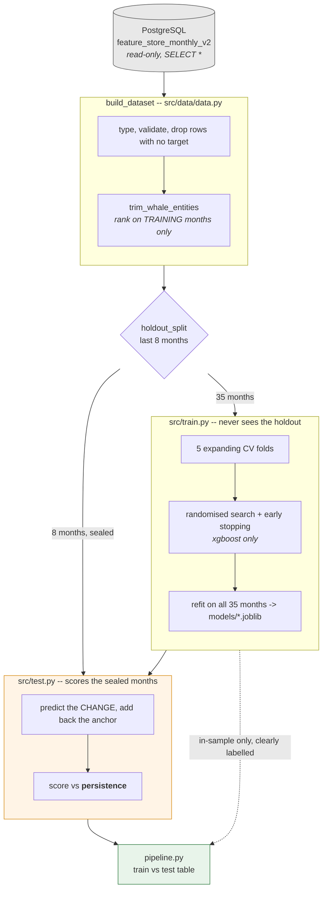

# ml_prediction

Forecasting next month's closing balance per user, from a monthly feature table
in an existing PostgreSQL instance (read-only, `localhost:5433`).

```bash
python pipeline.py
```

One command, no arguments. Every setting lives in `config/ml_config.yaml`;
an experiment is a config edit, not a flag.

## The pipeline



The split between `train.py` and `test.py` is the point: the module that fits
cannot read the months the module that scores uses. In-sample scores are
computed in `pipeline.py` alone, in one labelled place.

## The five things that matter

**1. The target is the movement, not the level.** A user's balance next month
is mostly their balance this month, so `r2_level` reads ~1.000 for a predictor
a person could do in their head. `r2_change` puts the month-to-month movement
in the denominator instead. Negative means worse than assuming nothing moves.
Same dollar errors, different denominator — and the disagreement is the finding.

**2. The reference is persistence, not the 3-month average.** The 3-month
average is the *worst* predictor in the table (WAPE 22.5, `r2_change` −4.2), so
skill measured against it flatters everything. The booster read **+0.561**
against the 3-month average and **+0.002** against persistence. Only the second
number means anything. Set in `evaluation.reference_model`.

**3. `gap` is over MAE, not RMSE.** RMSE here is decided by a handful of very
large accounts, so the RMSE ratio measures how calm those accounts happened to
be in the holdout window rather than how hard the model fitted — persistence,
which cannot overfit by construction, scored the same 0.81 as the booster. Over
MAE the two separate at 2.3x and 2.5x. A diagnostic a constant predictor passes
is not a diagnostic.

**4. WAPE is the headline, and it is not comparable across trim levels.** Total
absolute error over total absolute truth. MAPE divides each row by its own
truth and these balances pass through zero. Removing whales moves WAPE's
denominator, so WAPE compares models *within* a dataset — never across two.
Use `skill` and `gap` for that.

**5. The whale trim removes users, not rows.** `data.trim_top_entities` drops
the largest share of *entities*, ranked on median `|prev_1m_closing_balance_usd|`
over the training months only. Trimming the largest *rows* would gap each user's
own lag features and would select on the target. It is a statement about which
population is served, not a cleaning step.

## Conclusion

**Nothing beats persistence on this panel, and the ceiling says nothing will.**

Measured over 150 users x 43 months:

| | |
|---|---|
| lag-1 correlation of the change with its own last change | **0.002** |
| variance of the change explained by per-user mean drift, *in-sample* | **2.4%** |
| variance explained by month effects, *in-sample* | **1.2%** |
| holdout persistence | WAPE **13.02**, `r2_change` **−0.009** |

That 2.4% is the ceiling, and it is in-sample. Nothing tested cleared it:
not the v1 dollar features, not the v2 ratios, not their union, not `change` /
`scaled_change` / `signed_log_change`, not absolute / squared / pseudo-huber
loss. Blending the booster toward zero makes WAPE monotonically worse. Per tier
it loses to persistence everywhere (smb +4.3% MAE, mid +0.2%, ent +9.1%).

Trimming whales at 3% brings the booster level with persistence but no further
-- test MAE **17,595** against persistence's **17,591**, a 0.02% difference:

| model | train_mae | test_mae | gap | test_wape | r2_change | skill |
|---|---|---|---|---|---|---|
| persistence | 6,865 | **17,591** | 2.56 | **12.544** | -0.011 | ref |
| xgboost_change | 6,489 | 17,595 | 2.71 | 12.547 | -0.006 | +0.003 |
| three_month_average | 8,485 | 31,111 | 3.67 | 22.185 | -4.641 | -1.362 |
| ridge_change | 11,091 | 35,067 | 3.16 | 25.006 | -1.820 | -0.670 |

With the randomised search **switched off** -- fixed defaults, 300 rounds,
depth 4 -- the same trim pushes `r2_change` to **+0.026**, the only positive
value anything in this project has produced. The configured search gives
**-0.006**. The search is picking a worse model on the honest metric: it ranks
candidates on `r2` over the dollar change (whale-dominated squared error) and
early stopping then cuts the booster to **6 rounds**. See defect 3 below, and
do not read the `+0.026` as a pipeline result.

v2 also went backwards where it replaced rather than augmented: it dropped
`roll3_mean_net_flow_usd` and `prev_1m_net_flow_usd` — the top two features by
both ridge coefficient and xgboost gain in v1 — and its CV r² fell from 0.045 to
0.028. Ridge on v2 is worse than the baseline it is supposed to beat.

**The signal is not in this table.** Further tuning or feature engineering on
monthly aggregates is very unlikely to pay. The direction worth funding is new
information: within-month transaction timing, recurring-payment and salary
detection, calendars of known scheduled inflows. "No model beats persistence"
is a legitimate, well-evidenced result and should be reported as the headline.

## Known defects

- `ridge` with `scaled_change` or `signed_log_change` explodes (WAPE 2.3e3 and
  3.8e6). The inverse transforms are unstable; both modes are unusable as written.
- `reg:pseudohubererror` predicts a **literal constant** — `huber_slope`
  defaults to 1 on a dollar-scale target, so the gradient saturates immediately.
  It appears to win benchmarks because it has rediscovered persistence.
- `models[].search.scoring: r2` in the config contradicts
  `tuning.DEFAULT_SCORING = "neg_median_absolute_error"` and its stated
  reasoning, and searches on squared error while fitting `reg:absoluteerror`.
  **Not cosmetic:** the search plus early stopping settles on 4-6 trees and
  scores `r2_change` -0.006 where untuned defaults score +0.026.

## Layout

```
config/ml_config.yaml             every tunable setting
pipeline.py                       run everything, print train vs test
src/data/data.py                  the feature table + the whale trim
src/data/db_link.py               engine + query to DataFrame (read-only)
src/feature_engineering_v2/       the v2 ratio features
src/window.py                     holdout and expanding-window CV folds
src/metrics.py                    scoring, and the two framings to read it in
src/evaluate.py                   breakdowns by month, user and account tier
src/tuning.py                     randomised search and its folds
src/importance.py                 gain and coefficient rankings
src/models_code/base_class.py     the model interface, save/load, target modes
src/models_code/entity_scaler.py  per-entity robust scale
src/models_code/baseline.py       persistence (n_months 1), 3-month average
src/models_code/ridge_reg.py      ridge, level and change target modes
src/models_code/xgboost_model.py  boosted trees, deliberately small
src/train.py / src/test.py        fit + save / score on unseen months
notebooks/                        local exploration only
models/                           one .joblib per model (gitignored)
```

## Resources

- https://machinelearningmastery.com/feature-selection-with-real-and-categorical-data/
- https://medium.com/@mouadenna time-series-splitting-techniques-ensuring-accurate-model-validation-5a3146db3088
- https://machinelearningmastery.com/feature-selection-with-real-and-categorical-data/
- https://zams.com/blog/introducing-wape
- https://towardsdatascience.com/how-to-forecast-time-series-using-lags-5876e3f7f473/