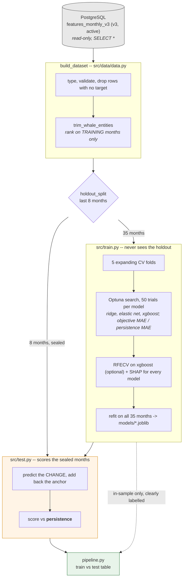
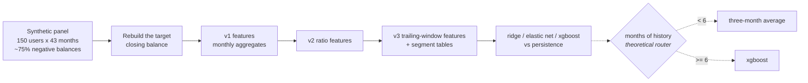

# ml_prediction

Forecasting next month's closing balance per user, from a monthly feature table
in an existing PostgreSQL instance (read-only, `localhost:5434`).

```bash
python pipeline.py
```

One command, no arguments. Every setting lives in `config/ml_config.yaml`;
an experiment is a config edit, not a flag.

## The pipeline


```mermaid
flowchart TD
    DB[("PostgreSQL<br/>features_monthly_v3 (v3, active)<br/><i>read-only, SELECT *</i>")]
    DB --> BUILD

    subgraph BUILD["build_dataset -- src/data/data.py"]
        direction TB
        B1["type, validate, drop rows with no target"]
        B2["trim_whale_entities<br/><i>rank on TRAINING months only</i>"]
        B1 --> B2
    end

    BUILD --> CUT{"holdout_split<br/>last 8 months"}

    CUT -->|"35 months"| TRAIN
    CUT -->|"8 months, sealed"| TEST

    subgraph TRAIN["src/train.py -- never sees the holdout"]
        direction TB
        T1["5 expanding CV folds"]
        T2["Optuna search, 50 trials per model<br/><i>ridge, elastic net, xgboost; objective MAE / persistence MAE</i>"]
        T4["RFECV on xgboost (optional) + SHAP for every model"]
        T3["refit on all 35 months -> models/*.joblib"]
        T1 --> T2 --> T4 --> T3
    end

    TRAIN --> TEST

    subgraph TEST["src/test.py -- scores the sealed months"]
        direction TB
        S1["predict the CHANGE, add back the anchor"]
        S2["score vs <b>persistence</b>"]
        S1 --> S2
    end

    TEST --> TABLE["pipeline.py<br/>train vs test table"]
    TRAIN -.->|"in-sample only, clearly labelled"| TABLE

    style DB fill:#e8e8e8,stroke:#555
    style TEST fill:#fff4e6,stroke:#d68910
    style TABLE fill:#e8f4ea,stroke:#2d7a3e
```

The split between `train.py` and `test.py` is the point: the module that fits
cannot read the months the module that scores uses. In-sample scores are
computed in `pipeline.py` alone, in one labelled place.

## The five things that matter

**1. The target is the movement, not the level.** A user's balance next month
is mostly their balance this month, so `r2_level` reads ~1.000 for a predictor
a person could do in their head. `r2_change` puts the month-to-month movement
in the denominator instead. Negative means worse than assuming nothing moves.
Same dollar errors, different denominator — and the disagreement is the finding.

**2. The reference is persistence, not the 3-month average.** The 3-month
average is the *worst* predictor in the table (WAPE 22.5, `r2_change` −4.2), so
skill measured against it flatters everything. The booster read **+0.561**
against the 3-month average and **+0.002** against persistence. Only the second
number means anything. Set in `evaluation.reference_model`.

**3. `gap` is over MAE, not RMSE.** RMSE here is decided by a handful of very
large accounts, so the RMSE ratio measures how calm those accounts happened to
be in the holdout window rather than how hard the model fitted — persistence,
which cannot overfit by construction, scored the same 0.81 as the booster. Over
MAE the two separate at 2.3x and 2.5x. A diagnostic a constant predictor passes
is not a diagnostic.

**4. WAPE on the balance is flattering, and it is not comparable across trim levels.** Total
absolute error over total absolute truth. MAPE divides each row by its own
truth and these balances pass through zero. Removing whales moves WAPE's
denominator, so WAPE compares models *within* a dataset — never across two.
Use `skill` and `gap` for that. To rank models, read `wape_change_%` and `mase`.

**5. The whale trim removes users, not rows.** `data.trim_top_entities` drops
the largest share of *entities*, ranked on median `|prev_1m_closing_balance_usd|`
over the training months only. Trimming the largest *rows* would gap each user's
own lag features and would select on the target. It is a statement about which
population is served, not a cleaning step.

## Process followed


```mermaid
flowchart LR
    D["Synthetic panel<br/>150 users x 43 months<br/>~75% negative balances"] --> R["Rebuild the target<br/>closing balance"]
    R --> V1["v1 features<br/>monthly aggregates"]
    V1 --> V2["v2 ratio features"]
    V2 --> V3["v3 trailing-window features<br/>+ segment tables"]
    V3 --> M["ridge / elastic net / xgboost<br/>vs persistence"]
    M -.-> RT{"months of history<br/><i>theoretical router</i>"}
    RT -.->|"< 6"| P["three-month average"]
    RT -.->|">= 6"| X["xgboost"]
```

**The data limits every model.** The dataset is synthetic, and the target
closing balance had to be reconstructed in earlier steps. That rebuilt target
carries little month-to-month structure, so no feature set or model clearly
beats persistence (see Conclusion).

**Feature versions.** Three feature tables were tried; v3 is the one in use.

| Version | Table | What it added | Outcome |
|---|---|---|---|
| v1 | `feature_store_monthly` | Monthly aggregates: balance lags, flows, spend by category, 3-month rolling stats | Baseline feature set |
| v2 | `feature_store_monthly_v2` | Ratio features (growth, flow-to-balance) | Dropped: it replaced the two strongest v1 features and CV r² fell |
| **v3** | `features_monthly_v3` | v1 columns + 6-month trailing-window features + segment ids | **In use** |

### Segments

v3 places every row into three segmentations. Each uses the trailing six
months, M-6..M-1, so the label is known on day 1, and is recomputed every
month, so a user moves segment after a shift. Each has a `seg_*` lookup table
in Postgres and an `*_id` column in v3. Cut values live in the config under
`segments`. Id 0 is **unassigned**: the 6-month window is not full yet (each
user's first 6 months, 900 rows) or a component could not be computed.

**1. `sign_regime`: which side of zero the user lives on** (`sign_regime_id`, `seg_sign_regime`)

| Component | How it is calculated |
|---|---|
| `share_neg_last_6m` | Share of the months M-6..M-1 whose closing balance is below zero |
| `debt_depth_6m` | Lowest balance in M-6..M-1 as a positive amount (0 if it never went negative), divided by `turnover_roll6`. Null when turnover is under $100 |

| Id | Category | Rule | Rows |
|---|---|---|---|
| 1 | not_always_negative | `share_neg_last_6m <= 0.9` | 1,624 |
| 2 | shallow_negative | `share_neg_last_6m > 0.9` and `debt_depth_6m <= 2` | 1,493 |
| 3 | deep_negative | `share_neg_last_6m > 0.9` and (`debt_depth_6m > 2` or null) | 2,433 |

**2. `size`: how much money moves through the account** (`size_id`, `seg_size`)

| Component | How it is calculated |
|---|---|
| `turnover_roll6` | Mean over M-6..M-1 of monthly credited + \|debited\|, in dollars |

| Id | Category | Rule | Rows |
|---|---|---|---|
| 1 | low_turnover | `turnover_roll6 <= 5,000` | 666 |
| 2 | mid_turnover | `5,000 < turnover_roll6 <= 20,000` | 3,512 |
| 3 | high_turnover | `turnover_roll6 > 20,000` | 1,372 |

Size is measured on turnover, not balance. A month's change cannot exceed what
flowed in and out, so turnover is the scale of the target: Spearman with
\|change\| is 0.51 for turnover against 0.35 for median \|balance\|. With ~75%
of balances negative, \|balance\| mostly re-measures debt depth, which
`sign_regime` already holds.

**3. `behaviour`: how steady the money flow is** (`behaviour_id`, `seg_behaviour`)

| Component | How it is calculated |
|---|---|
| `roll6_std_net_flow` | Standard deviation of monthly net flow (in minus out) over M-6..M-1 |
| `flow_volatility_6m` | `roll6_std_net_flow` divided by `turnover_roll6`, so large and small accounts compare. Null when turnover is under $100 |

| Id | Category | Rule | Rows |
|---|---|---|---|
| 1 | stable | `flow_volatility_6m <= 0.20` | 2,482 |
| 2 | moderate | `0.20 < flow_volatility_6m <= 0.50` | 2,011 |
| 3 | dynamic | `flow_volatility_6m > 0.50` | 911 |

Unassigned is 1,046: the 900 short-window rows plus 146 with turnover under
$100. The config's `min_months: 3` has no effect, because the components need
the full 6 months anyway.

**How the ids are used.** Per-segment CV (`segment_cv.csv`) checks whether a
model beats persistence inside each category; none does yet. The full config
feeds the ids to xgboost as ordered numbers; the top-15 config and the linear
models drop them.

**Disregarded segmentations.** Account tier (median \|balance\| over the
training months: smb, mid, enterprise) found xgboost losing to persistence in
every tier, and `size` replaced it. Activity tercile (median
`prev_1m_txn_count`) showed momentum that held on the holdout, but only on
~50 users.

**Future segmentation: `history`** (in the code only; `history_id` and
`seg_history` appear once the v3 job is re-run). It counts the months with a
balance in M-6..M-1: thin (< 6) or full (6). It is dropped from every model
and exists for routing. The router is theoretical: fewer than 6 months would
go to the three-month average, because their trailing-window features are
empty, and 6 or more to xgboost. On this panel no scored row is thin, so it
would not change any result here. It is meant for the Stage 6 DAG, as a
`RoutedModel` behind the same `Model` interface, used by a `src/predict.py`
task. The rule stays in the model rather than in DAG branching, so the
pipeline, the tests and the DAG route the same way.

## Conclusion

**Nothing beats persistence on this panel, and the ceiling says nothing will.**

Measured over 150 users x 43 months:

| | |
|---|---|
| lag-1 correlation of the change with its own last change | **0.002** |
| variance of the change explained by per-user mean drift, *in-sample* | **2.4%** |
| variance explained by month effects, *in-sample* | **1.2%** |
| holdout persistence | WAPE **13.02**, `r2_change` **−0.009** |

That 2.4% is the ceiling, and it is in-sample. Nothing tested cleared it:
not the v1 dollar features, not the v2 ratios, not their union, not `change` /
`scaled_change` / `signed_log_change`, not absolute / squared / pseudo-huber
loss. Blending the booster toward zero makes WAPE monotonically worse. Per tier
it loses to persistence everywhere (smb +4.3% MAE, mid +0.2%, ent +9.1%).

Trimming whales at 3% brings the booster level with persistence but no further
-- test MAE **17,595** against persistence's **17,591**, a 0.02% difference:

| model | train_mae | test_mae | gap | test_wape | r2_change | skill |
|---|---|---|---|---|---|---|
| persistence | 6,865 | **17,591** | 2.56 | **12.544** | -0.011 | ref |
| xgboost | 6,489 | 17,595 | 2.71 | 12.547 | -0.006 | +0.003 |
| three_month_average | 8,485 | 31,111 | 3.67 | 22.185 | -4.641 | -1.362 |
| ridge | 11,091 | 35,067 | 3.16 | 25.006 | -1.820 | -0.670 |

With the randomised search **switched off** -- fixed defaults, 300 rounds,
depth 4 -- the same trim pushes `r2_change` to **+0.026**, the only positive
value anything in this project has produced. The configured search gives
**-0.006**. The search is picking a worse model on the honest metric: it ranks
candidates on `r2` over the dollar change (whale-dominated squared error) and
early stopping then cuts the booster to **6 rounds**. Do not read the
`+0.026` as a pipeline result. Optuna now ranks on MAE over persistence MAE.

v2 also went backwards where it replaced rather than augmented: it dropped
`roll3_mean_net_flow_usd` and `prev_1m_net_flow_usd` — the top two features by
both ridge coefficient and xgboost gain in v1 — and its CV r² fell from 0.045 to
0.028. Ridge on v2 is worse than the baseline it is supposed to beat.

**The signal is not in this table.** Further tuning or feature engineering on
monthly aggregates is very unlikely to pay. The direction worth funding is new
information: within-month transaction timing, recurring-payment and salary
detection, calendars of known scheduled inflows. "No model beats persistence"
is a legitimate, well-evidenced result and should be reported as the headline.

## Current xgboost parameters (Optuna)

Runs of 2026-10-01 on v3 (`features_monthly_v3`), trained through 2024-11.
Optuna ran 50 trials on the 5 training-region CV folds, weighted linearly
toward the later folds. The holdout was not read by any trial. Full records
are in `models/` (top-15) and `models_full/` (full features).

| parameter | top-15 (`models/`) | full (`models_full/`) |
|---|---|---|
| `objective` | `reg:pseudohubererror` | `reg:pseudohubererror` |
| `n_estimators` | 315 | 275 |
| `max_depth` | 5 | 6 |
| `learning_rate` | 0.0213 | 0.0172 |
| `min_child_weight` | 5.39 | 5.32 |
| `subsample` | 0.810 | 0.911 |
| `colsample_bytree` | 0.526 | 0.782 |
| `reg_lambda` | 42.83 | 26.12 |
| CV ratio to persistence MAE | 0.9875 | 0.9876 |
| seeds 1 / 2 / 3 | 0.9882 / 0.9883 / 0.9894 | 0.9883 / 0.9882 / 0.9888 |

The ~1.2% CV lead is the same size in both runs. Per fold, the two folds
closest to the holdout are level with persistence or worse (top-15: 1.004,
1.000; full: 1.009, 1.002).

Holdout (2024-12..2025-07), top-15 run:

| model | train_mae | test_mae | gap | test_wape | r2_change | skill_mae |
|---|---|---|---|---|---|---|
| persistence | 8,224 | **19,166** | 2.33 | **13.022** | -0.009 | ref |
| xgboost | 7,513 | 19,208 | 2.56 | 13.051 | -0.006 | -0.002 |
| elastic_net | 8,009 | 19,232 | 2.40 | 13.067 | -0.011 | -0.003 |
| ridge | 8,017 | 19,328 | 2.41 | 13.133 | -0.016 | -0.008 |
| three_month_average | 9,815 | 33,186 | 3.38 | 22.548 | -4.226 | -0.732 |

The CV lead does not survive the holdout: persistence is best, and the paired
test under Tests finds no real difference.

## Top-15 feature trial (2026-10-01)

Each family kept only its 15 highest-SHAP features, with RFECV off. The full
config is in `config/ml_config.full.yaml` and its outputs are in `models_full/`.

- **MSE is in squared dollars.** The billions are RMSE squared
  (52,445² ≈ 2.75bn). Read RMSE or MAE for the error size.
- **`alpha` is a penalty, not an error.** CV pushed it to ~1M for ridge and
  ~82k for elastic net. Elastic net zeroed all 15 coefficients and ridge's SHAP
  values are under $12, so both reduce to persistence plus mean drift.

| model | full features, test_mae | top-15, test_mae |
|---|---|---|
| persistence | **19,165** | **19,165** |
| xgboost | 19,247 | 19,208 |
| elastic_net | 19,870 | 19,232 |
| ridge | 19,981 | 19,328 |

The linear models improve on top-15 only because they fall back to
persistence. Nothing beats it, which agrees with the Conclusion.

## Tests

Run `pytest -s` from the project root. It needs Postgres up and both
`models/` (top-15) and `models_full/` (full features) trained. Results of
2026-10-01; the % is the challenger's change in test MAE, + means worse.

| Test | Definition | Result |
|---|---|---|
| Prediction files align | Both runs score the same 1,200 holdout rows with the same truth | **Pass** |
| Paired Champion Challenger | Same rows, per-row \|error\| difference; 95% interval by resampling users, Wilcoxon on per-user means | **No difference** in all 12 comparisons: xgboost top-15 vs persistence +0.22% (p 0.20), full vs persistence +0.43% (p 0.13) |
| Dynamic Overdraft | Rows with `sign_flips_6m >= 2` (84 rows, 26 users) | **No difference**: top-15 +0.26%, full +0.56% vs persistence |
| Zero Income | Rows with `prev_1m_total_credited_usd == 0` (116 rows, 47 users) | **No difference**: top-15 +0.73%, full +0.05% vs persistence |
| Gig Income | Rows with `income_cv_6m >= 1.0`, a fixed line because the training quartile drifted (319 rows, 88 users) | **No difference**: top-15 +0.13%, full +0.02% vs persistence |
| Top-15 vs full features | xgboost top-15 against xgboost full, on every slice above | **No difference**: -0.21% on all rows (p 0.12) |
| No Balance Data | Blank last month's balance; a model passes if its MAE stays within 1.5x of the last known balance (`prev_2m` → `prev_3m` → median, MAE ~36k) | **Fail** for persistence, ridge, elastic net and xgboost (MAE ~145-147k); **pass** for three_month_average |

Not run yet: Thin Data (waits for the router), Recovering, Overshoot Guard and High Burden.

| File | What it does |
|---|---|
| `src/scenarios.py` | The holdout slices (`SCENARIOS`) and the paired test; in `src/` so the pipeline can reuse them |
| `tests/conftest.py` | Loads the saved models, the train/holdout split and both prediction files once |
| `tests/test_champion_challenger.py` | Alignment check, then writes `results/scenario_tests.csv`. Report only: losing to persistence is a finding, not a failure |
| `tests/test_no_balance.py` | The No Balance check. Hard pass/fail: a wrong fallback is a defect |
| `pytest.ini` | Puts the project root on the path and points pytest at `tests/` |

## Known defects

- **No last balance.** With `prev_1m_closing_balance_usd` missing, ridge,
  elastic net and xgboost return the predicted change as the balance (~$0),
  and persistence returns the training median. The fix is one shared
  `prev_1m` → `prev_2m` → `prev_3m` fallback; `tests/test_no_balance.py` fails until then.
- **`behaviour.min_months` is inert.** See Segments: the components need 6 months anyway.
- Fixed: `reg:pseudohubererror` used to predict a constant because
  `huber_slope` defaulted to 1; it is now set at fit time to the median
  \|training target\|.

## Layout

```
config/ml_config.yaml             every tunable setting (top-15 trial)
config/ml_config.full.yaml        the same with every feature
pipeline.py                       run everything, print train vs test
src/data/data.py                  the feature table + the whale trim
src/data/db_link.py               engine + query to DataFrame (read-only)
src/config/config.py              config loading and output paths
src/log.py                        run logs in results/logs/
src/feature_engineering_v2/       the v2 ratio features
src/window.py                     holdout and expanding-window CV folds
src/metrics.py                    scoring, and the two framings to read it in
src/evaluate.py                   breakdowns by month, user and account tier
src/scenarios.py                  scenario slices + paired champion-challenger test
src/optuna_search.py              Optuna study on the CV folds, writes *_best_params.json
src/feature_selection.py          RFECV on xgboost, SHAP, linear coefficient lists
src/feature_engineering_v3/       v3 features and the four segment tables (PySpark)
src/models_code/base_class.py     the Model interface, save/load
src/models_code/exceptions.py     NotFittedError
src/models_code/anchored_model.py change target: learn balance - last balance, add it back
src/models_code/baseline.py       persistence (n_months 1), 3-month average
src/models_code/ridge_reg.py      ridge on the monthly change
src/models_code/elastic_net.py    ridge plus an L1 penalty
src/models_code/xgboost_model.py  boosted trees, deliberately small
src/train.py / src/test.py        fit + save / score on unseen months
notebooks/                        local exploration only
models/                           one .joblib per model (gitignored)
models_full/                      the full-feature run, kept for comparison
results/                          run logs and scenario_tests.csv
tests/                            scenario report + no-balance fallback test
```

## Resources

- https://machinelearningmastery.com/feature-selection-with-real-and-categorical-data/
- https://medium.com/@mouadenna time-series-splitting-techniques-ensuring-accurate-model-validation-5a3146db3088
- https://machinelearningmastery.com/feature-selection-with-real-and-categorical-data/
- https://zams.com/blog/introducing-wape
- https://towardsdatascience.com/how-to-forecast-time-series-using-lags-5876e3f7f473/