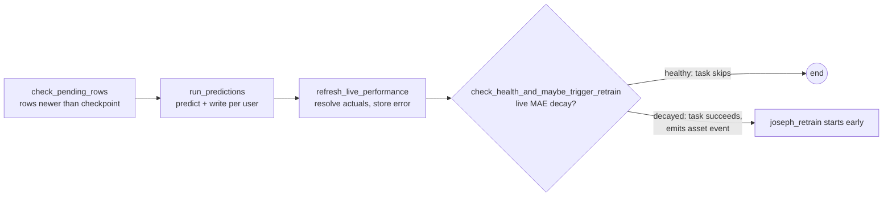
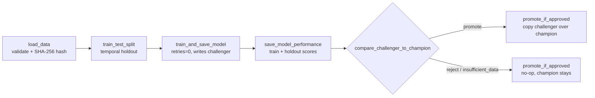
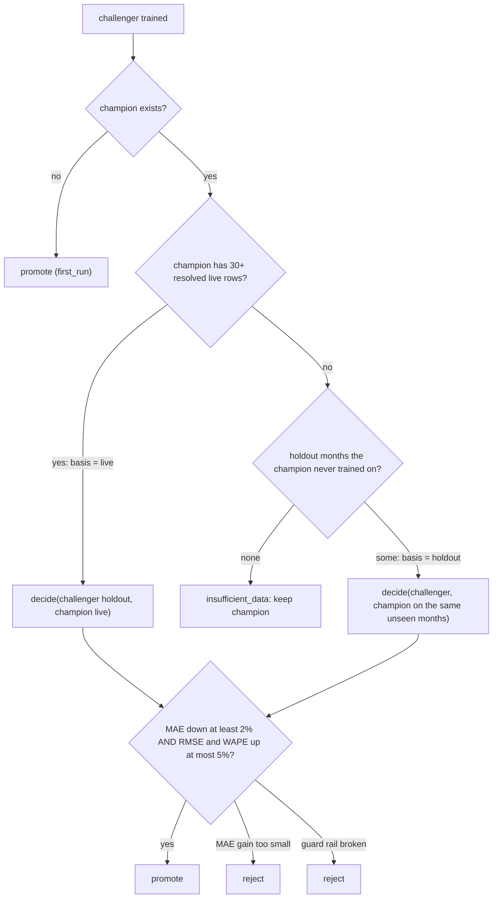

# DAG report

Two batch DAGs under `dags/`, both thin wiring over `dags/dag_utils/`. Every task logs what it did and has an `execution_timeout`; defaults are `retries=5`, `retry_delay=30s`.

| | `joseph_prediction` | `joseph_retrain` |
|---|---|---|
| Schedule | `@daily` | Monday 00:00 UTC (`RETRAIN_SCHEDULE` overrides), or early on a health-check asset event |
| `max_active_runs` / `catchup` | 1 / False | 1 / False |
| Reads | Feature rows newer than each user's checkpoint | Full feature table |
| Writes | `predictions`, `checkpoints`, `live_performance` | `models/serving/challenger/`, `model_performance`, and the champion on promotion |

## 1. Prediction DAG (daily)

- **check_pending_rows** reads the champion's metadata and the `checkpoints` table. A user with no checkpoint starts after the champion's last training month, so rows the model trained on are never served.
- **run_predictions** predicts every pending row. The routed model sends rows with no last-month balance to `skip`. Each user's predictions and checkpoint commit in **one transaction**, so a crash leaves finished users saved and the rest still pending. A failed user is logged and the others continue. It raises only if every user failed.
- **refresh_live_performance** joins predictions to the real closing balance and stores the signed error. It is insert-only, so running it daily is safe.
- **check_health_and_maybe_trigger_retrain** raises `AirflowSkipException` when healthy. Only a successful run emits the asset event that starts the retrain DAG.

## 2. Retrain DAG (weekly floor, or early)

- **load_data** logs the trigger (`scheduled`, `asset_triggered` or `manual`), the row and column counts, and the hash. The hash goes through XCom.
- **train_test_split / train_and_save_model** reload the data and fail if its hash changed, so a task can never train on different rows than `load_data` saw. The split is temporal: the last 20% of months are the holdout. Training refits the tuned xgboost parameters and writes the challenger plus `metadata.json` (version, data hash, training date, scores, code commit). The champion is never touched.
- **save_model_performance** writes the train and holdout scores keyed on `(model_version, split)`; a rerun inserts nothing.
- **promote_if_approved** copies the model, then the metadata, each through an atomic file swap. A crash between the two is caught on load by a version mismatch.

## 3. What we retrain on, and why

| Trigger | Rule | Why |
|---|---|---|
| Weekly floor | Cron `0 0 * * 1` | New months of data keep arriving; this bounds how stale the champion can get. |
| Early, on decay | Live MAE over the last 3 resolved months is more than 10% above the champion's holdout MAE, with at least 30 resolved rows | Retrain when real error rises, not on every run. |
| Cooldown | No early retrain within 3 days of the last | A noisy signal cannot cause a retrain loop. |

- **Rejected policies:** "retrain every run" and "never retrain". The target is close to unpredictable, so a model refit on noise can easily be worse than the live one, which is why the champion/challenger gate below exists.
- **Failed retrains are low-cost:** the old champion keeps serving until the next successful retrain.

## 4. Champion vs challenger

The challenger is judged on the rows the **xgboost route** serves, since other rows are served by persistence.

- **Live comparison first:** real-world error is the better judge. Training metrics are never compared directly.
- **Holdout fallback:** with fewer than 30 resolved live rows, both models score months that neither has trained on.
- **Promotion bar:** MAE must drop by at least 2%, and RMSE and WAPE may rise by at most 5%. A tie keeps the champion, which is always the safe outcome.
- **Logged every time:** both models' scores, the basis, the decision and the reason.

## 5. Safe to run twice

| Step | Why a rerun is harmless |
|---|---|
| Predictions | Primary key `(user_id, month)` with `ON CONFLICT DO NOTHING` |
| Checkpoint | `GREATEST` upsert, so it never moves backwards |
| Live performance, model performance | Insert-only on their keys |
| Promotion | Atomic file swap; marks `promoted_at` once |
| Training | `retries=0`; a rerun makes a new version and overwrites only the challenger |

## 6. Traceability

- **Prediction → model:** `model_version` (e.g. `xgb-20261007T0600-1a2b3c4d`) is on every row of `predictions`.
- **Model → data and code:** `models/serving/<champion|challenger>/metadata.json` holds the data hash, training date, scores and git commit; `model_performance` repeats the hash.

## 7. Monitoring

- **Built:** live MAE decay against the champion's holdout MAE. It logs the reading, the threshold and the decision, and triggers an early retrain.
- **Described only:**
  - Prediction-distribution drift against a trailing average.
  - Late or empty input: today `check_pending_rows` logs `0 pending` and the run ends without an alert.
  - A rising failed-user count in `run_predictions`.

## 8. If it breaks

| Symptom | Action |
|---|---|
| `no champion yet` in the prediction logs | Trigger `joseph_retrain` once. |
| `training data changed since load_data` | New rows landed mid-run; trigger the DAG again from the start. |
| `train_and_save_model` failed | It does not retry; read the log, fix, then Clear the task. |
| `run_predictions` failed for some users | Their checkpoints did not move; the next run retries them. |
| Model and metadata versions differ on load | A promotion crashed halfway; Clear `promote_if_approved` to finish it. |
